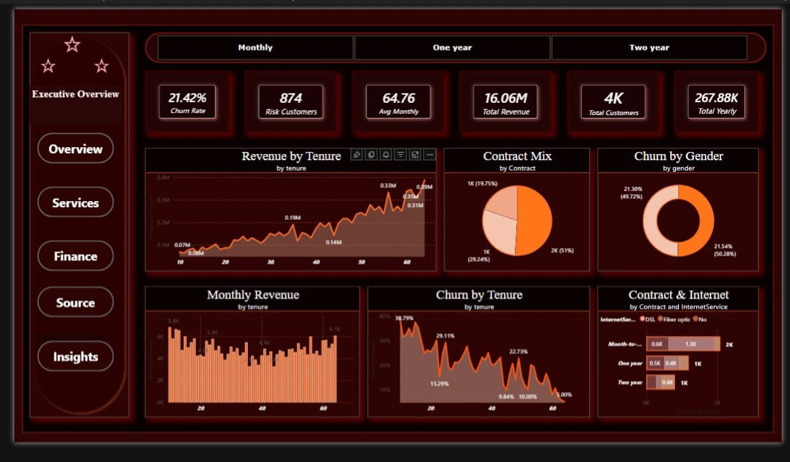
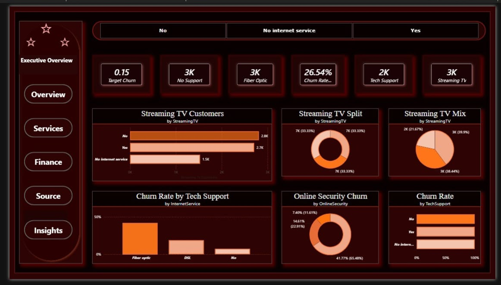

# MarketPulse Analytics - Telecom Dashboard

An interactive Power BI dashboard designed to analyze telecom customer behavior, service performance, and key performance indicators (KPIs), powered by SQL data extraction.

## Dashboard Preview

### Page 1: Executive Overview

### Page 2: Services & Customer Insights

## Project Overview
This project transforms raw telecom data into actionable insights, helping stakeholders monitor service performance, understand customer retention, and track key business trends.

## Tools & Technologies
- SQL: Data extraction and querying.
- Power BI: Data modeling, Power Query, DAX, and interactive visualizations.

## Key Insights
- Identified patterns in customer churn and service usage.
- Visualized revenue distribution and key performance metrics across segments.
